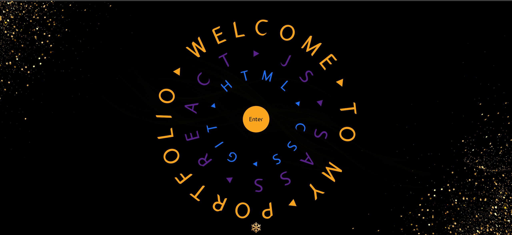
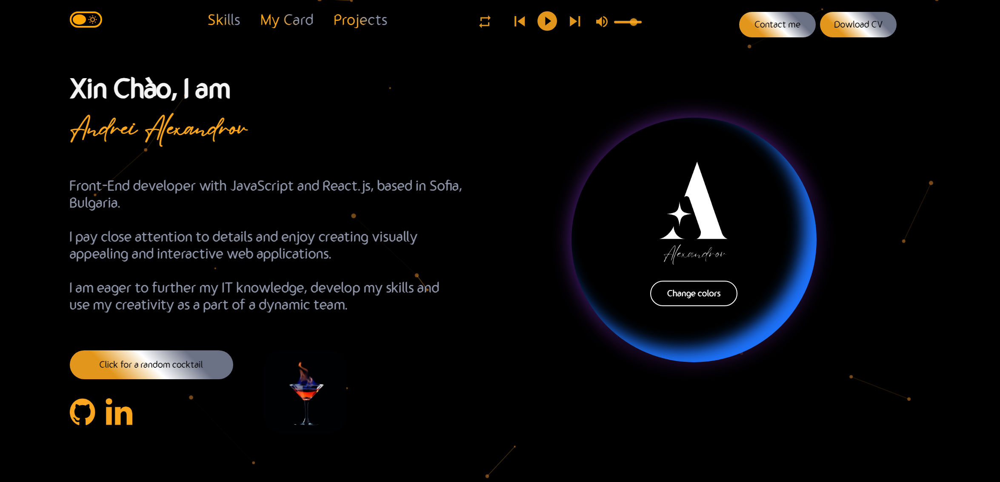
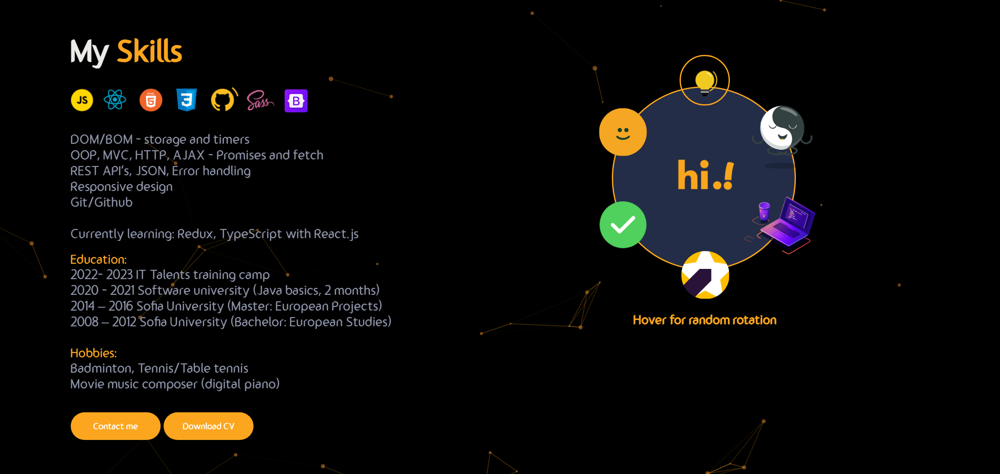
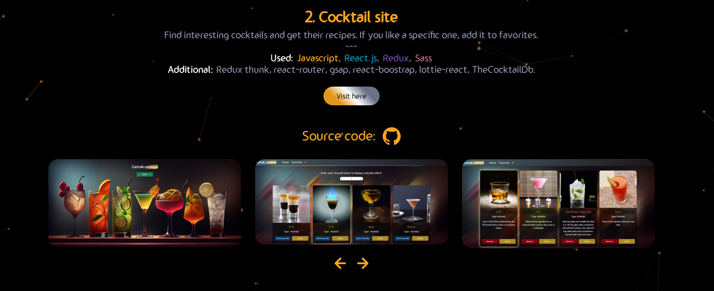
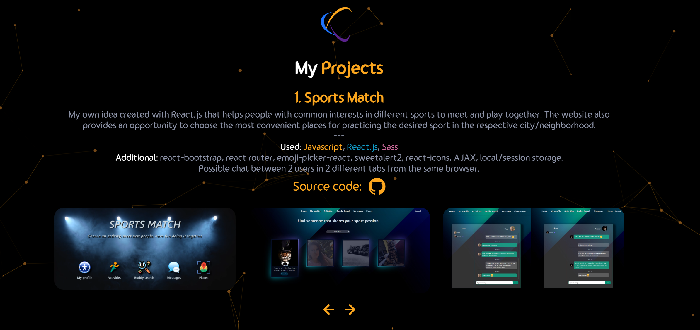
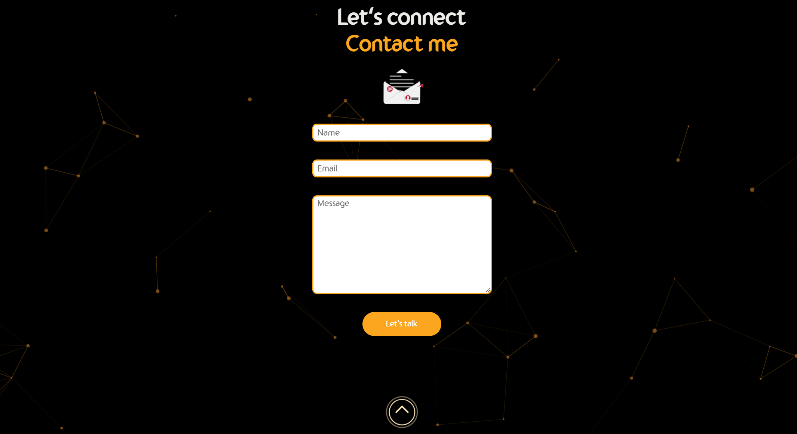
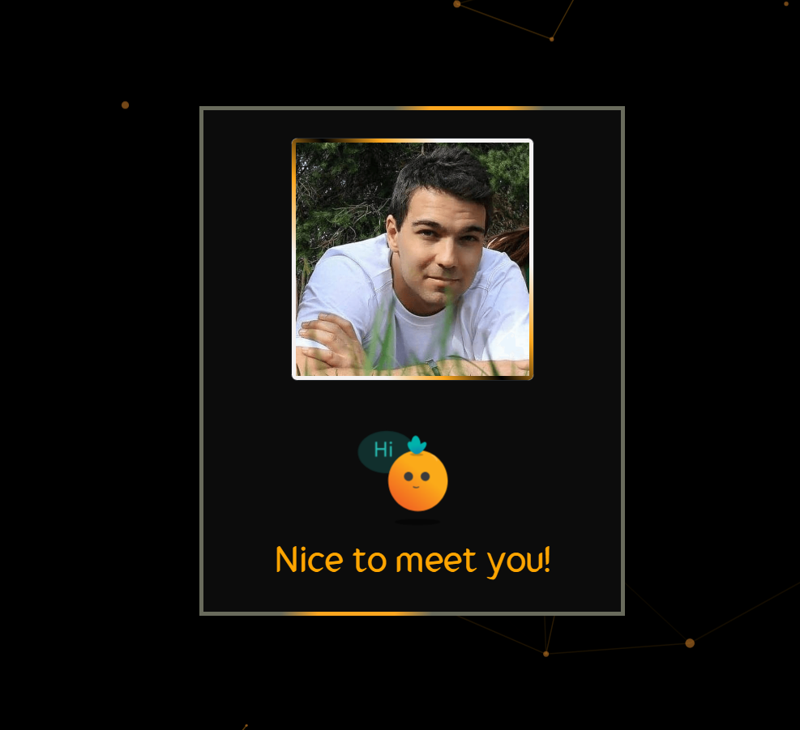
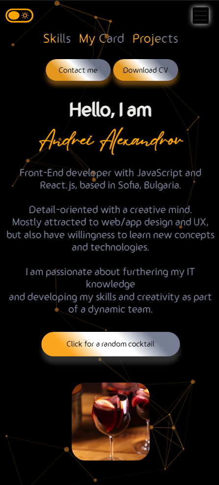

I created my portfolio using React.js + some external libraries like swiper, react-particles, SASS, emailJS, react-scroll, iconscout/react-unicorns and others. It is also fully responsive.
Hamburger navbar menu for smaller screens.

Added various motion effects using framer-motion, Lottie and SASS styling. Added light/dark theme.

Open this link [https://andrei-alexandrov-portfolio.netlify.app/](https://andrei-alexandrov-portfolio.netlify.app/) to view it.

## Summary
0. Starting Page
1. About me section
2. Skills section
3. My Card section
4. Projects section
5. Contact section

## Portfolio images

## Available Scripts

In the project directory, you can run (using Git Bash):

### `npm install`
### `npm start`

Open this link [http://localhost:3000](http://localhost:3000) to view it in your browser.
