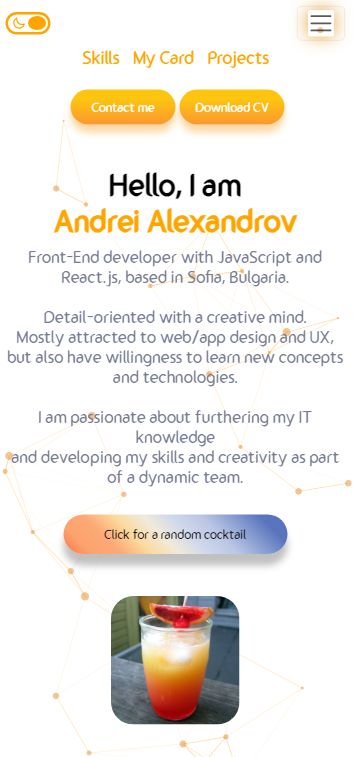

I created my portfolio using React.js + some external libraries like swiper, react-particles, SASS, emailJS, react-scroll, iconscout/react-unicorns and others. It is also responsive.

Added various motion effects using framer-motion and css/sass styling. Added light/dark theme.

Open this link [https://andrei-alexandrov-portfolio.netlify.app/](https://andrei-alexandrov-portfolio.netlify.app/) to view my portfolio.

## Summary
1. About me section
2. Skills section
3. Projects section
4. Contact section

## Some images

## Available Scripts

In the project directory, you can run:

### `npm install`
### `npm start`

Runs the app in the development mode.\
Open this link [http://localhost:3000](http://localhost:3000) to view it in your browser.

The page will reload when you make changes.
